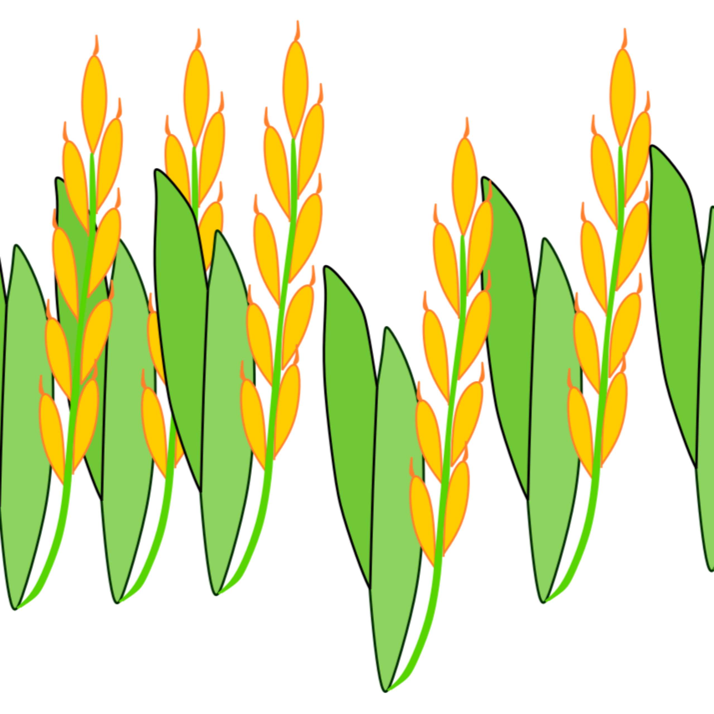

Where I chronicle my experiences as a graduate student and practice my science communication skills  

<table style="padding:200px" border=0>
  <tr>
    <td> 
         </td>
      
 <td>&emsp;&emsp;Move over, Neolithic ancestors: Designer domesticates are here</td>
  </tr>
  <tr>
    <td> 
         </td>
      
 <td>&emsp;&emsp;Returning to the bench</td>
  </tr>
  
  
  <tr>
    <td> 
         </td>
      
 <td>&emsp;&emsp;On the trail of evolutionary origin stories</td>
  </tr>
  
  <tr>
    <td> 
         </td>
      
 <td>&emsp;&emsp;I study population genetics. What does that mean?</td>
  </tr>
  
  <tr>
    <td> 
         </td>
      
 <td>&emsp;&emsp;Tutorial: Building a simple epidemic model on R</td>
  </tr>
  
  <tr>
    <td> 
         </td>
      
 <td>&emsp;&emsp;An invisible domesticate: The tangled history of beer</td>
  </tr>
  
  <tr>
    <td> 
         </td>
      
 <td>&emsp;&emsp;Popular science books: An appreciation post</td>
  </tr>
  
  <tr>
    <td> 
         </td>
      
 <td>&emsp;&emsp;A budding interest in plants</td>
  </tr>
  
  
  <tr>
    <td> 
         </td>
      
 <td>&emsp;&emsp;Host-transposon conflict in light of hybridization</td>
  </tr>
  
  <tr>
    <td> 
         </td>
      
 <td>&emsp;&emsp;Could high genetic diversity increase extinction risk?</td>
  </tr>
  
  <tr>
    <td> 
         </td>
      
 <td>&emsp;&emsp;Tutorial: Depth of coverage analysis</td>
  </tr>
  
  <tr>
    <td> 
         </td>
      
 <td>&emsp;&emsp;The quiet wars of mitochondria</td>
  </tr>
  
  <tr>
    <td> 
         </td>
      
 <td>&emsp;&emsp;The beginning</td>
  </tr>
  
  
</table>