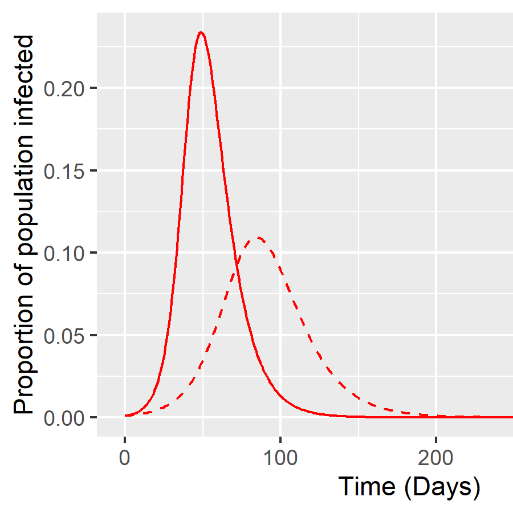
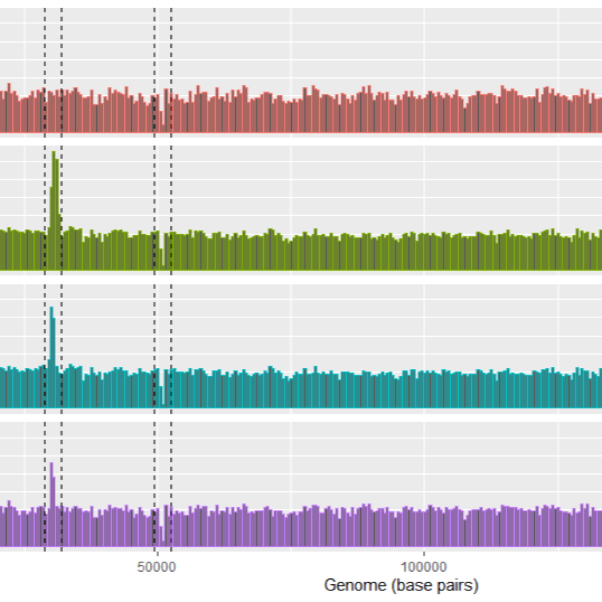

Where I chronicle my experiences as a graduate student and practice my science communication skills  

---

<table style="padding:20px">
  <tr style="cursor: pointer;" onclick="window.location='https://thegenomeinquirer.wordpress.com/2021/02/12/move-over-neolithic-ancestors-its-the-age-of-designer-domesticates/'" >
    <td> 
         
         </td>
 <td>&emsp;&emsp;</td>
 <td style="width:70%">Move over, Neolithic ancestors. Designer domesticates are here</td>
  </tr>
</table>
---
<table style="padding:20px">
  <tr >
    <td> 
         </td>
 <td>&emsp;&emsp;</td>     
 <td style="width:70%">Returning to the bench</td>
  </tr>
</table>
---
<table style="padding:20px">
  <tr>
    <td> 
         </td>
 <td>&emsp;&emsp;</td>     
 <td style="width:70%">On the trail of evolutionary origin stories</td>
  </tr>
</table> 
---
<table style="padding:20px"> 
  <tr>
    <td> 
         </td>
 <td>&emsp;&emsp;</td>     
 <td style="width:70%">I study population genetics. What does that mean?</td>
  </tr>
</table>  
---
<table style="padding:20px">
  <tr>
    <td> 
         </td>
 <td>&emsp;&emsp;</td>     
 <td style="width:70%">Tutorial: Building a simple epidemic model on R</td>
  </tr>
</table>  
---
<table style="padding:20px">
  <tr>
    <td> 
         </td>
 <td>&emsp;&emsp;</td>     
 <td style="width:70%">An invisible domesticate: The tangled history of beer</td>
  </tr>
</table>  
---
<table style="padding:20px">  
  <tr>
    <td> 
         </td>
<td>&emsp;&emsp;</td>    
 <td style="width:70%">Popular science books: An appreciation post</td>
  </tr>
</table> 
---
<table style="padding:20px">  
  <tr>
    <td> 
         </td>
 <td>&emsp;&emsp;</td>     
 <td style="width:70%">A budding interest in plants</td>
  </tr>
</table> 
---
<table style="padding:20px">
  <tr>
    <td> 
         </td>
<td>&emsp;&emsp;</td>      
 <td style="width:70%">Host-transposon conflict in light of hybridization</td>
  </tr>
</table>
---
<table style="padding:20px">
  <tr>
    <td> 
         </td>
 <td>&emsp;&emsp;</td>     
 <td style="width:70%">Could high genetic diversity increase extinction risk?</td>
  </tr>
</table>  
---
  <table style="padding:20px">
   <tr>
    <td> 
         </td>
 <td>&emsp;&emsp;</td>      
 <td style="width:70%">Tutorial: Depth of coverage analysis</td>
  </tr>
</table>
---
<table style="padding:20px">
  <tr>
    <td> 
         </td>
 <td>&emsp;&emsp;</td>     
 <td style="width:70%">The quiet wars of mitochondria</td>
  </tr>
</table>  
---
<table style="padding:20px"> 
  <tr>
    <td> 
         </td>
 <td>&emsp;&emsp;</td>     
 <td style="width:70%">The beginning</td>
  </tr>
 </table> 

  
  
