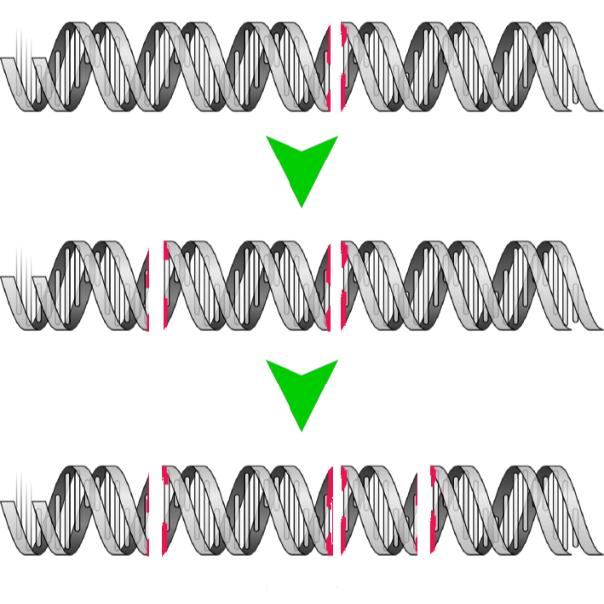

<table style="padding:50px" border=0>
  <tr>
    <td> 
         </td>
      
 <td>Move over, Neolithic ancestors: Designer domesticates are here</td>
  </tr>
  <tr>
    <td> 
         </td>
      
 <td>Returning to the bench</td>
  </tr>
</table>